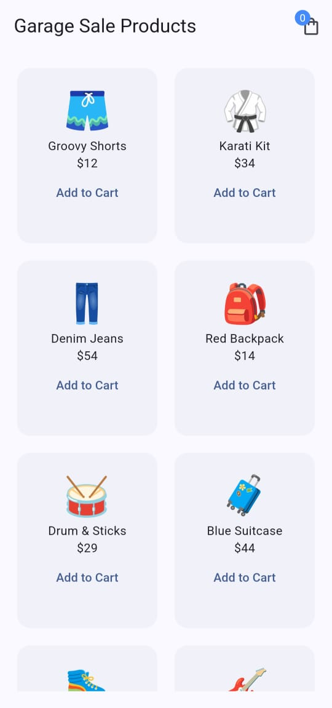
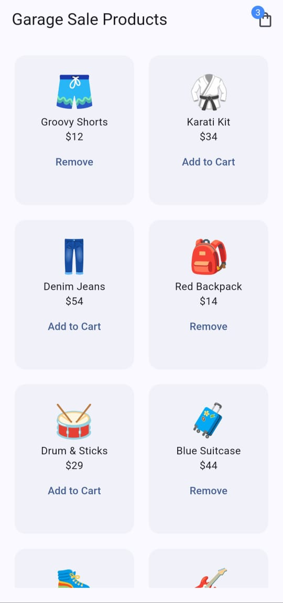
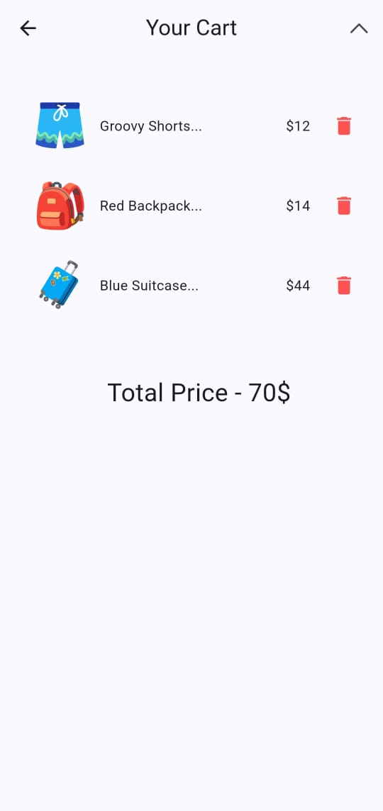
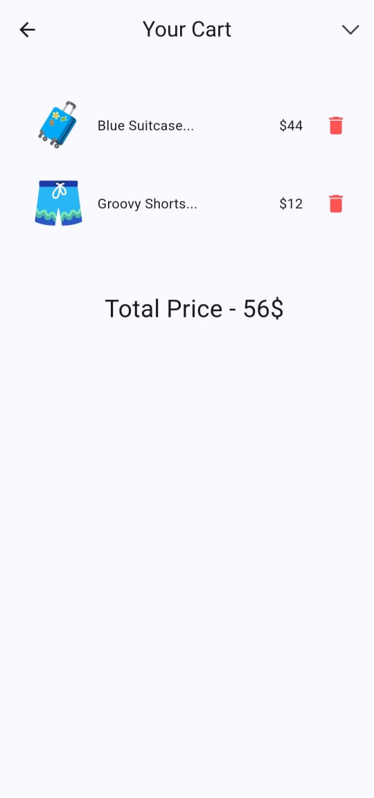

# Garage Sale App

This is a simple Flutter application that demonstrates state management using Riverpod. The app displays a list of products and allows users to add or remove items from their shopping cart.

## Features

- Display a list of products.
- Add or remove products from the cart.
- View the cart and sort the items by price in ascending or descending order.
- Riverpod is used to manage application state efficiently.

## Screens

### Home Screen

- Displays products in a grid view.
- Products can be added to or removed from the cart.
- The cart icon in the app bar shows the number of items in the cart.

### Cart Screen

- Displays all the products added to the cart.
- Allows the user to sort products by price in ascending or descending order.
- Shows the total price of the products in the cart.

## Packages Used

- `flutter_riverpod`: State management package used to handle product and cart state efficiently.

## Project Structure

```bash
lib/
│
├── provider/
│ ├── cart_provider.dart # Manages the state of the cart
│ └── product_provider.dart # Provides product data
│
├── screens/
│ ├── home_screen.dart # Home screen displaying products
│ └── cart_screen.dart # Cart screen displaying selected products
│
└── shared/
└── cart_icon.dart # Widget for displaying the cart icon in the AppBar

```

## State Management with Riverpod

Riverpod is used in this project to manage the state of the product list and the cart.

### Providers

- **`productsProvider`**: Provides the list of products displayed in the app.
- **`cartNotifierProvider`**: Manages the cart, including adding and removing products, and sorting products in the cart.

### Consumer Widgets

- **`ConsumerWidget`**: Used in the `HomeScreen` to read the list of products and cart state.
- **`ConsumerStatefulWidget`**: Used in the `CartScreen` to manage sorting products by price and removing items from the cart.

## How It Works

### Home Screen

```dart
final allProducts = ref.watch(productsProvider); // Watches the product list
final cartProducts = ref.watch(cartNotifierProvider); // Watches the cart state
```

- The HomeScreen displays the list of products in a GridView. Users can add products to the cart using the "Add to Cart" button or remove them if they’re already added.

### Cart Screen

```dart
final cartProducts = ref.watch(cartNotifierProvider); // Watches the cart state
final total = ref.watch(cartTotalProvider); // Watches the total price of cart items
```

-The CartScreen displays all the products in the cart. Users can sort products by price in ascending or descending order and view the total price of the cart.

### How to Run the App

1. Clone this repository:

```bash
git clone https://github.com/mananKoyawala/riverpod_garage_sale.git

```

2. Install dependencies:

```bash
flutter pub get

```

3. Run the app:

```bash
flutter run

```

## Screenshots

Here are the screenshots of the app in action:

### Home Screen



### Cart Screen - Before Sorting



### Cart Screen - Ascending Sort



### Cart Screen - Descending Sort


